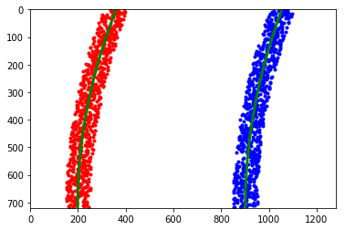

# Advance Lane Lines

<a href="http://www.youtube.com/watch?feature=player_embedded&v=u9XTdT2nVkw
" target="_blank">

The Project
---

The goal of this project is to develop a pipeline to process a video stream from a forward-facing camera mounted on the front of a car, and output an annotated video which identifies:

* The positions of the lane lines
* The location of the vehicle relative to the center of the lane
* The radius of curvature of the road

The steps of this project are the following:

1. Compute the camera calibration matrix and distortion coefficients given a set of chessboard images.
2.  Apply a distortion correction to raw images.
3.  Apply a perspective transform to rectify binary image ("birds-eye view").
4.  Use color HLS color filtering transforms and sobel gradients to create a thresholded binary image.
5. Detect lane pixels and fit to find the lane boundary.
6. Determine the curvature of the lane and vehicle position with respect to center.
7. Warp the detected lane boundaries back onto the original image.
8. Output visual display of the lane boundaries and numerical estimation of lane curvature and vehicle position.


## 1. Camera calibration and distorsion correction

The code use for the camara calibratio is base in the Udacity repository:  [CarND-Camera-Calibration](https://github.com/udacity/CarND-Camera-Calibration/blob/master/camera_calibration.ipynb)

To calibrate the camera we shall create the image and object points.
The image points are points in images taken with the camera that can be mapped to a object points (reference points).

The object points are the same for all the images as all the calibration images are chess boards of the same dimension (6x9). 

The images points are arrays with the coordinates of the corners of the chess board.


    Object point (1st row):
    [[ 0.  0.  0.]
     [ 1.  0.  0.]
     [ 2.  0.  0.]
     [ 3.  0.  0.]
     [ 4.  0.  0.]
     [ 5.  0.  0.]
     [ 6.  0.  0.]
     [ 7.  0.  0.]
     [ 8.  0.  0.]]
    
    Images points (1st row):
    [[ 622.59265137  147.06881714]
     [ 661.09936523  162.3087616 ]
     [ 697.16424561  177.31687927]
     [ 731.43341064  191.54307556]
     [ 763.58007812  205.2311554 ]
     [ 793.96057129  218.34494019]
     [ 822.22521973  230.58702087]
     [ 849.57891846  242.73017883]
     [ 874.94610596  253.94567871]]


The coordinates of the corners in the image point are saved and they will be compared with object points to calibrate the camera. The calibration camera uses multiple images, in our case we have 19 calibration images.


Use the object points and the image points to calibrate the camera


```python
# Do camera calibration given object points and image points
ret, mtx, dist, rvecs, tvecs = cv2.calibrateCamera(objpoints, imgpoints, img_size, None, None)
```

Create the pipeline function for undistort images using the calibration camera parameters.


```python
def undistortImg(img, mtx, dist):
```

Test the undistorsion function


## 2. Perpective transformation

In order to change the perpesctive of a image, the source and destination area should be defined:


```python
#Define the points of the source area
srcPointDownLeft  = [ int(imshape[1]*0.15),  int(imshape[0]*0.95) ]
srcPointUpLeft    = [ int(imshape[1]*0.40),  int(imshape[0]*0.65) ]

srcPointDownRight = [ int(imshape[1]*0.90),  int(imshape[0])*0.95]
srcPointUpRight   = [ int(imshape[1]*0.60),  int(imshape[0]*0.65) ]
    
#Define the points of the destination area
destPointDownLeft  = [ int(imshape[1]*0.24),  int(imshape[0]*0.95)]
destPointUpLeft    = [ int(imshape[1]*0.07),  int(imshape[0]*0.0)]

destPointDownRight = [ int(imshape[1]*0.85),  int(imshape[0])*0.95]
destPointUpRight   = [ int(imshape[1]*0.96),  int(imshape[0]*0.0)]

```

Create the pipeline function for get a bird eye perspective using the source and destination area defined before


```python
def birdEye(img, src, dst): 
```

Test the birdEye function using the test images. The red polygon is the source area while the green one is the destination area. The values of the source and destination polygon were chosen manually and verified with the straight lane lines test image (first 2 images).


## 3. Threshold and color filtering

### 3.1 HLS color filtering 

The HLSFilter function will mask the image based on a HLS space color depending on the minimum and maximum thresholds set as parameter of the function. 
The function returns the masked images, masked HLS channels and the  HLS channels.


In following cell, the descomposition of in HLS channels for every images is shown. Looking at the saturated channel is evident that is easy to get the yellow color from this channel. However, in those images with shades the saturation channel is not enough to recognizes properly the yellow line (7th image). But the hue channel could be used to removed from the image the shades. By the other hand the white color, it is observed that the white color can be easly identified using the L channel. 


The thresholds for the white mask are defined using only the L channel. By the other hand, as explained above, the thresholds for the yellow mask are defined using the H and S channel. An important annotation is that the sensitivity for the white mask could not be set higher than 45, otherwise al lot of noise will not be filtered in the images with high light density (images 3rd and 6th).


```python
#Color mask 
sensitivity = 45 
WhiteLowMask  = [ 0, 255-sensitivity, 0]
WhiteHighMask = [255, 255, 255]

#yellow mask 
sensitivity = 125 
YellowLowMask  = [ 0, 50, 255-sensitivity]
YellowHighMask = [100, 255, 255]

```


### 3.2 Sobel threslhold

The function absSobelThresh will apply the sobel operator on the image. The parameters are the kernel size and the threshold.


```python
def absSobelThresh(img, orient='x', sobel_kernel=5, thresh=(0, 255)):
```

The sobel operation is applied in the X orientantion as the lines searched are vertical. However the improvement given by the sobel mask is reduced compare with the color mask. to have into account that if the low and high thresholds are not chosen correctly, a lot of noise will pass to the final mask images, producing  errors in the curvature calculation.


```python
threshVal = (50, 250)
```


## 4 Finding the lines and calculate the curvature

### 4.1 Measuring the curvature and offset

The curvMeasuring function calculates the curvature giving the coordinates: y and x. The maths of this function are fin in this [link](http://www.intmath.com/applications-differentiation/8-radius-curvature.php). As the x and y coordinates are based into a image that is supposed to be 1260 x 720. To obtain a real value, this coordinates are transform in a real physical space using: *ym_per_pix* and *xm_per_pix*. The values are calculate from the point that the lane is about 30 meters long and 3.7 meters wide. 


```python
# Define conversions in x and y from pixels space to meters
ym_per_pix = 30/720 # meters per pixel in y dimension
xm_per_pix = 3.7/700 # meters per pixel in x dimension

```

In the following cell the curvMeasuring measuring courve will be test using some fake data.



    Left curve radio: 514.943402143 m 
    Right curve radio:  550.980558204 m


The vehicle offset is calculate using the the polynomial evaluate at the bottom for the left and right line. And calculating the offset of its center to the center of the image.


```python
def vehOffset(left_fit, right_fit):
```

    Vehicle offset:  0.476073637074 m


### 4.2 Finding the lines on the first frame (blind search)

To find the lines in the images there are 2 algorithms that could be applied. The blind search that is used on the first frame of the video and the nonìblind search that is used after the first 2 lines are identified. I this chapeter is explained the algorithm of the blind search.

#### 4.2.1 Histogram and base points

The first step is to identify the base point of the lines. To do this, an histogram of the lower part of the images is calculate and the maxium points of the 2 verticals half are identified. These 2 points are the baseìpoints for the left and right lines. From this point the second part of the algorithm will start.


```python
def basePoints(img):
```

Note that the error in the base points will increase with the area of the lower part. Take for instance the image right line of the 4th images. if the area chosen is *y = [400, 720]* the base point will be around *1110* but if the area is *y =[500, 720]*, the base point will be around *1130*. However as smaller the area the chances to find a line in that are decrease, giving as result non basepoints to start the algorithm.


    Mean Inte Lane distance:  659.875


#### 4.2.2 Fit the polynomial

From the basepoint calculated, a sliding window algorithm is used to go up the end of line and fit the polynomial. The algorithm set a windown in the base-points and save the points inside the window. The window is slided up and recentered. The window is recentered only if a minimum number of pixels are found inside the window. The window is centered to the mean of the pixels inside the window. Again, the pixel inside the window are saved. Once the window has reached the top of the image, the points saved in each iteration are used to fit a polynomial. 

There are 3 parameters to calibrate: *number of windows*, *minimum pixel number to recenter the window* and the *margin*. The margin is useful to filter the noise left by the sobel and color mask If the margin is too high, the noise beside the lines will affect the curvature calculation.


```python
def fitLineInitPolynomial(img, margin):
```

Applying the sliding algorithm and calculating the curvature to each figure it is observed that the polynomial and the curvature is higly sensitive to lightly changes of the curve. Only in 3 of the 8 test images its observed a coherent value between right and left.


### 4.3 Finding the lines after the first frame (non blind search)

The non-blind search algorith is similar to the one explained above, but instead of multiple windows. a single strip center in the last polynomial is used. The strip has a width (or margin) determinate by a parameter. All the points inside the strip are saved to calculate a new polynomial.


```python
def fitLinePolynomial(img, left_fit, right_fit, margin = 100):   
```

The algorthim is validated calculating the polynomial with the blind search and with the non-blind search.


## 5 Drawing

The area inside the 2 lines is drawn in a fake warped image and after using the perspective inverse matrix to print in the original image.


```python
def drawing(img, warped, Minv, left_fit, right_fit, no_error):     
```


## 6. Pipeline

Build the pipeline with all the function used to process the image.


```python
def pipeline(img):
    
    # Unditort image
    imgUndist = undistortImg(img, mtx, dist)
    
    #Apply perpective transformation
    imgWarped, M, Mi = birdEye(imgUndist, src, dst)
    
    #Apply color mask
    imgWhiteMask, imgWhiteDesc = HLSFilter(imgWarped, WhiteLowMask, WhiteHighMask)
    imgYellowMask, imgYellowDesc = HLSFilter(imgWarped, YellowLowMask, YellowHighMask)  
    ImgColorMask = CombMask(imgWhiteMask, imgYellowMask)
    
    #Apply Sobbel mask
    ImgSobelMask = absSobelThresh(imgWarped, orient='x', thresh = threshVal)
    ImgMask = CombMask(ImgSobelMask, ImgColorMask)
    
    #Fit polynomial
    left_fit, right_fit, left_curveRad, right_curveRad, out_img, nonzero = fitLineInitPolynomial(ImgMask, margin)
    
    #Calculate offset
    offset = vehOffset(left_fit, right_fit)
    
    #Draw the area
    result = drawing(imgUndist, imgWarped, Mi, left_fit, right_fit, True)
    
    #print curvature in image
    text = "".join(["Left curve radio:", str(left_curveRad), 'm'])
    cv2.putText(result,text,(10,50), cv2.FONT_HERSHEY_SIMPLEX, 1.5,(255,255,255),2,cv2.LINE_AA)
    text = "".join([ "Right curve radio: ", str(right_curveRad), 'm'])
    cv2.putText(result,text,(10,100), cv2.FONT_HERSHEY_SIMPLEX, 1.5,(255,255,255),2,cv2.LINE_AA)
    text = "".join([ "Offset: ", str(offset), 'm'])
    cv2.putText(result,text,(10,150), cv2.FONT_HERSHEY_SIMPLEX, 1.5,(255,255,255),2,cv2.LINE_AA)
    
    return result
    
```


## 7. Video processing

```python
clip_output = 'output_images/AdvanceLanDetection.mp4'

clip = VideoFileClip("project_video.mp4")
#clip = clip.fl_image(pipeline).subclip(0,10)
clip = clip.fl_image(pipeline)
%time clip.write_videofile(clip_output, audio=False)
```
<a href="http://www.youtube.com/watch?feature=player_embedded&v=5SHCIrOtI4k" target="_blank">


## 8. Pipeline plus

Build the pipeline with the track function and with the sanity check.

### 8.1 Line class definition

Define the class Line to be use during the video processing. The class provide methods to save its current status depending if the line is detected or not, and to access its internal data (Java style, not need for it). When the setting the current satus the Line class will save a filter value of the curvature and the fit.


```python
class Line():       
    def __init__(self):

        # was the line detected in the last iteration?
        self.detected = False    
        #polynomial coefficients averaged over the last n iterations
        self.best_fit = np.array([0,0,0])  
        #polynomial coefficients for the most recent fit
        self.current_fit = np.array([0,0,0]) 
        #radius of curvature of the line in some units
        self.radius_of_curvature = None 
        #distance in meters of vehicle center from the line
        self.line_base_pos = None 
        #difference in fit coefficients between last and new fits
        self.diffs = np.array([0,0,0], dtype='float') 
        #Curvatures of the last n iterations
        self.cuvature_log = []
    
    def setCurrentSts(self, currentFit, curvature):
    
    def getDetected(self):
    
    def getBestFit(self):
    
    def getCurvature(self):
    
    def getCurvatureLog(self):
        
```

### 8.2 Sanity check

The function will check that the 2 lines are parallel. It will take around 6 check points and calculate the distance netween the 2 lines. If the mean of the distance is not with in 5% of the average distance, it will consider as not parallel.


```python
def CheckParallel(img, left_fit, right_fit):
```

The sanity check implements all the function to check the sanity of the calculation.


```python
def SanityCheck(img, left_fit, right_fit, left_curveRad, right_curveRad):           
```

### 8.3 Pipeline plus definition

The pipeline plus implements the sanity check. If the sanity check is not pass for the current image, the Lane status is not saved and the last valid status is used. The area is red if an error is present in the current frame.


```python
L_Line = Line()
R_Line = Line()

def pipelinePlus(img):
       
    #Save the current status only if the sanity check has passed.
    if(sanity):
        L_Line.setCurrentSts(left_fit, left_curveRad )
        R_Line.setCurrentSts(right_fit, right_curveRad )
       
    return result
```

### 8.4 Video processing with pipeline plus


```python
clip = clip.fl_image(pipelinePlus)
```
<a href="http://www.youtube.com/watch?feature=player_embedded&v=u9XTdT2nVkw
" target="_blank">

### 8.5 Curvature log

The curvature log is display to evaluate the curvature calculation. Even if the curvature is already filtered (mean), it is oberved that in some points the change rate does not correspond to the real curvature. Moreover in some parts the differnce between the left and right lane is also a factor of error.

Note that the straight portion of the road is represented in the graph for a increase of both curvatures values.


## 9. Discussion

Ther are several aspect to improve in this pipeline:

1. The color mask is not really accurate in situations of low contrast as the challenge video. The color mask could use other color space as RGB or HSV to identify the lane.

2. The Sobel gradient does not improve the lane detection due its thresholds are too limited to avoid the introduction of noise in the picture. However, the direction or magnitude threshold could be combined to allow more wide threshold without the noise introduction.

3. The perpespective transformation for the bird eye view should follow a matematical method to chose the source and destination point. The calibration of these parameters are consider as break point for the performance of the pipeline.

4. The curvature calculation should be improve due with the current method there is a lot of error. One possibility could be forcing the introduction of limit data for calculating the polynomial. For instance the top and bottom points for the right line could set manually from the left points.

5. The pipeline plus could be improve introducing more sanity checks and implementing better filters for the curvature and the polynomial coefficents. 

6. The pipeline plus could be improve with an algorithm that detects the straight lines base on offical data.
